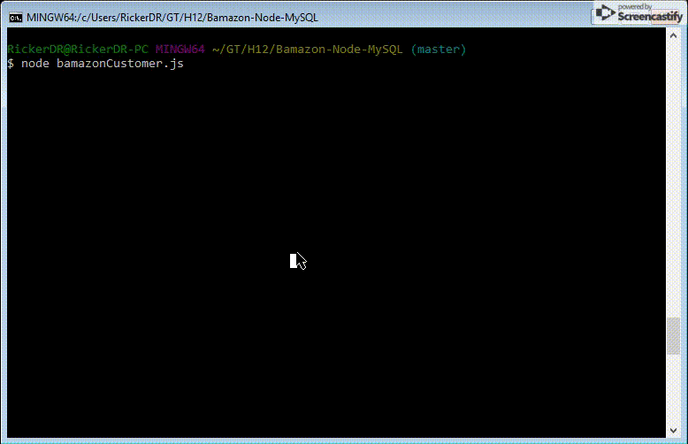

# Bamazon-Node-MySQL

##### Homework 12 - Node.js &amp; MySQL Storefront CLI App

Bamazon is an Amazon-like storefront CLI application created using Node.js and MySQL as the database for storing the information.  The application has three different JavaScript files that can be run either from the perspective of the Customer, Manager, or Supervisor; each of which allows the user to interact differently with the store.


## Getting Started

These instructions will get you a copy of the project up and running on your local machine for development and testing purposes.

### Prerequisites

In order to install and run LIRI you will need Node.js and MySQL; Links to which can be found below.

```
Node.js
MySQL
```

### Installing

You will need to do the following steps after cloning the repo to your device in order to ensure that it works properly.

To ensure Node.js is running within the package and configure all modules for use:

```
npm install
```

This should install all the requisite modules, but just in case, these are the ones necessary:

```
inquirer
colors
console.table
mysql
```

## Running Bamazon

Bamazon is run from the command line via three different options for the different interfaces:

#### As a Customer

```
node bamazonCustomer.js
```

This will bring you to the inquirer menu where you are able to select products to purchase.  That is the only options that are available to you as a customer.

 

#### As a Manager

```
node bamazonManager.js
```

This will bring you to the inquirer menu where you have more options for managing your store.  Here you are able to view all of the products available for sale (as well as more information about these items than the customer can see), view low inventory items, add items to inventory as shipments are received, and add a new product to the list of items available for sale.  I decided to add a few more parameters in order to hopefully keep the storefront from being able to be broken.

 

#### As a Supervisor

```
node bamazonSupervisor.js
```

This will bring you to the inquirer menu where you get to see an overview of how your store is performing (by being able to review the product sales by department) as well as adding another department to your store.  I also added in the options to remove departments (for those that are performing less than desired) as well as to update the overhead for a specific department should you wish to restructure expenditures.

 


## Built With

* [Node.js](https://nodejs.org/en/) - Runtime Environment
* [MySQL](https://www.mysql.com/) - Database
* [gitignore.io](https://www.gitignore.io/) - For creating the .gitignore
* [Screencastify](https://www.screencastify.com/) - For the gifs in the README.md
* [WebStorm](https://www.jetbrains.com/webstorm/) - IDE

## Authors

* **Dalton Ricker** - *Primary Author* - [SasquatchXYZ](https://github.com/SasquatchXYZ)

## Acknowledgments
* Many thanks to my instructors & TAs, as well as the O'Reilly reference books.